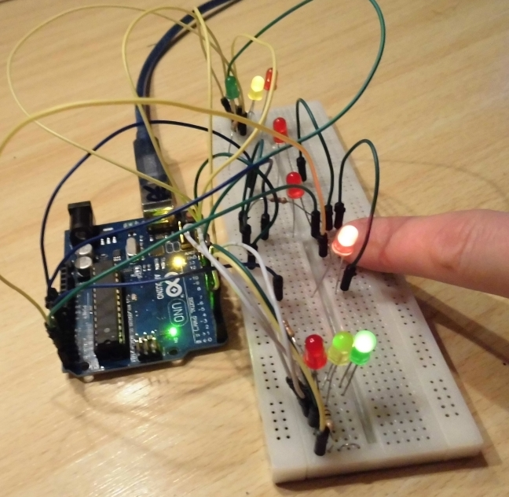
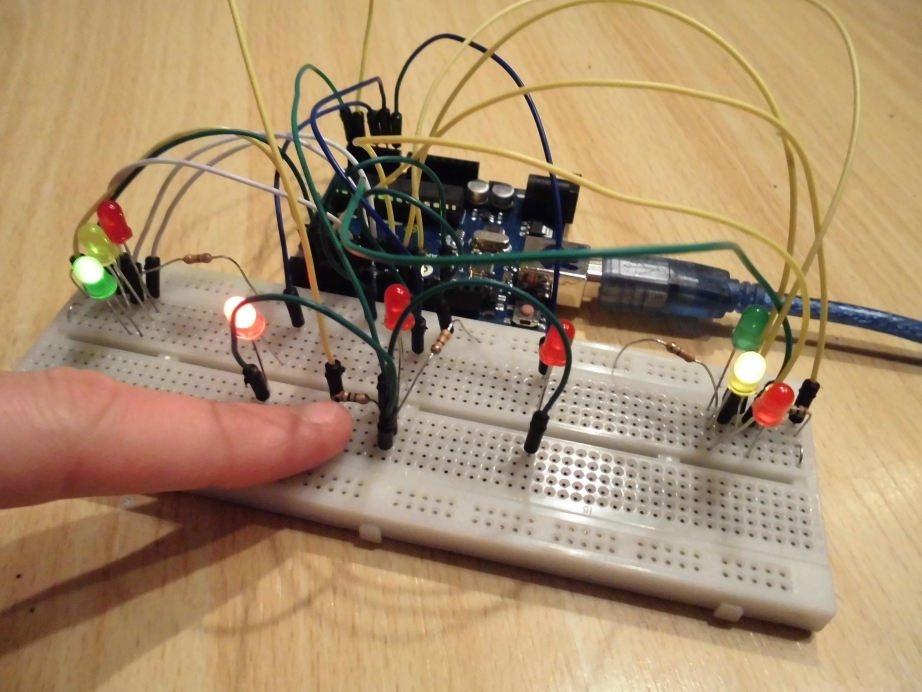
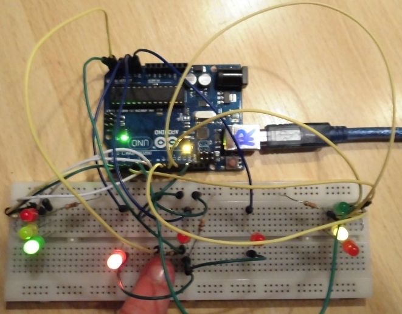
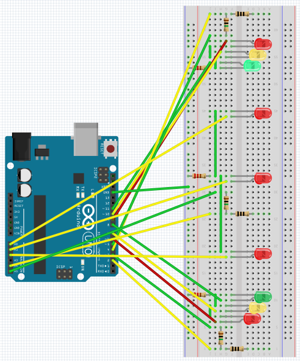
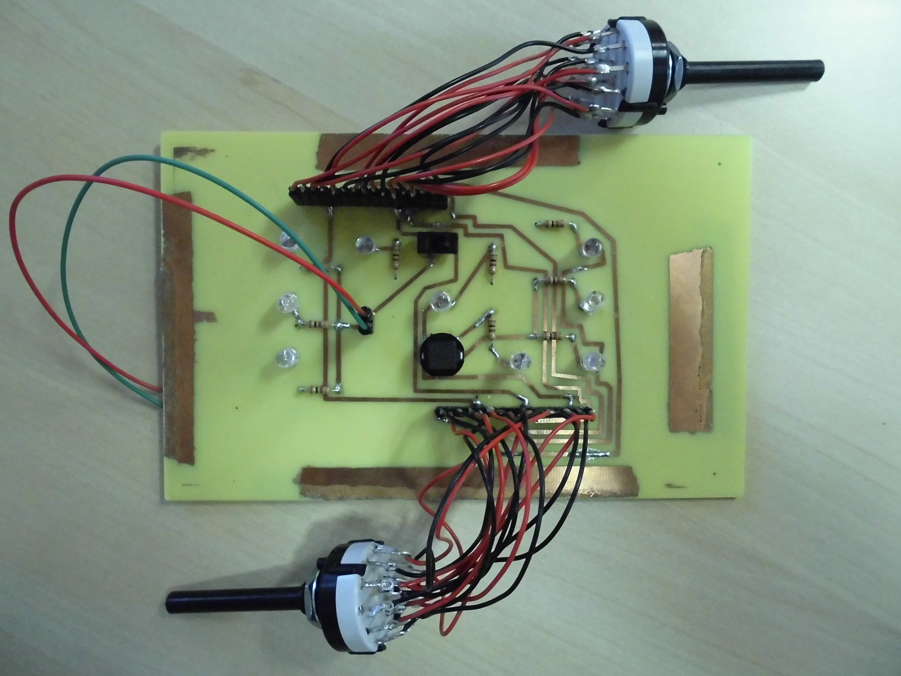
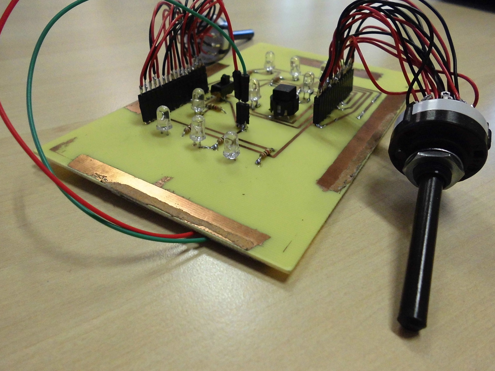
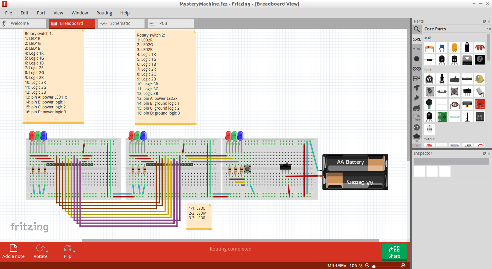
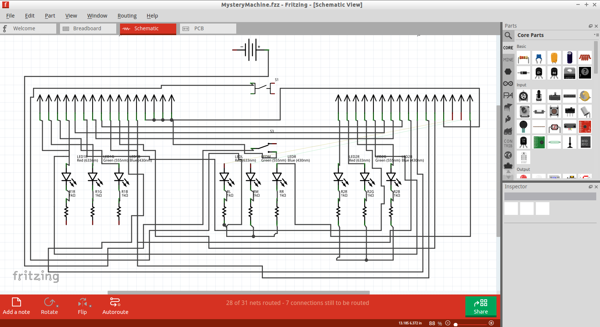
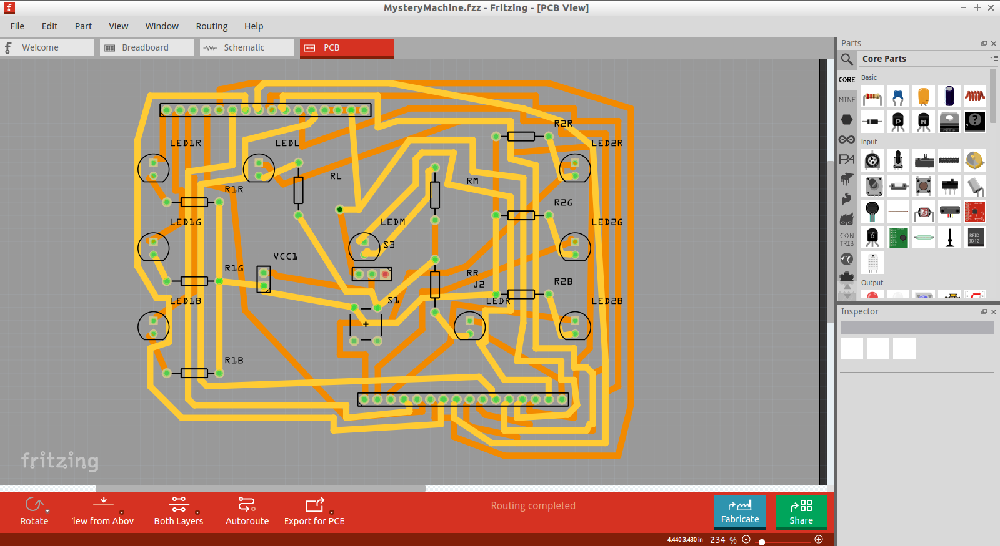

# MysteryMachine

MysteryMachine is a project about a machine with a certain function, which is kept a mystery on purpose.

There are two types of MysteryMachines:
 * MysteryMachine: the original
 * MysteryMachineDual: has two push buttons and two toggle buttons instead of one of each. This was chosen so to facilitate a fitting casing around it

If you prefer a simulation of MysteryMachine, go to [SimMysteryMachine](http://richelbilderbeek.nl/ToolSimMysteryMachine.htm).

## MysteryMachine with capacitative sensors

* [Schematic (Fritzing)](CapacitiveSensors/MysteryMachine.fzz)
* [Code (Arduino IDE)](CapacitiveSensors/MysteryMachine/MysteryMachine.ino)

## MysteryMachine with rotary switches

